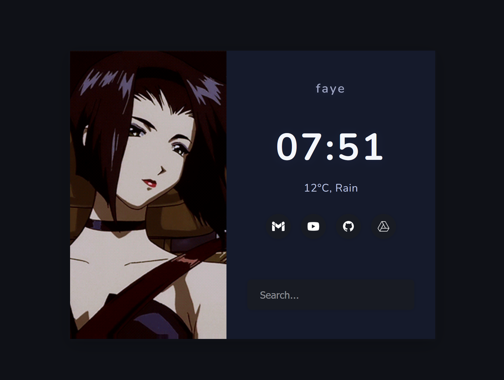

# faye

A minimal personal startpage I made for myself. It will receive updates.

## Features

- Layout for desktop use
- Current time
- Weather auto-detects your location (with permission)
- Google search bar

## Usage

1. Clone or download this repository.
2. Open [`index.html`](index.html).
3. Copy the path and set it as your browser start page.

## License

This project is licensed under the [MIT License](LICENSE).
